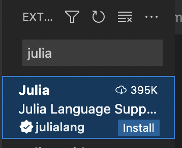
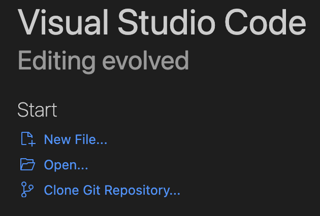
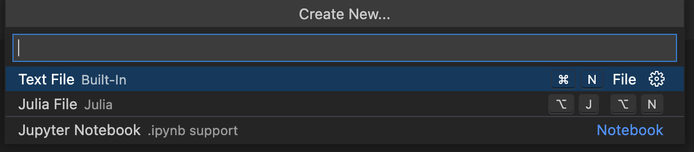
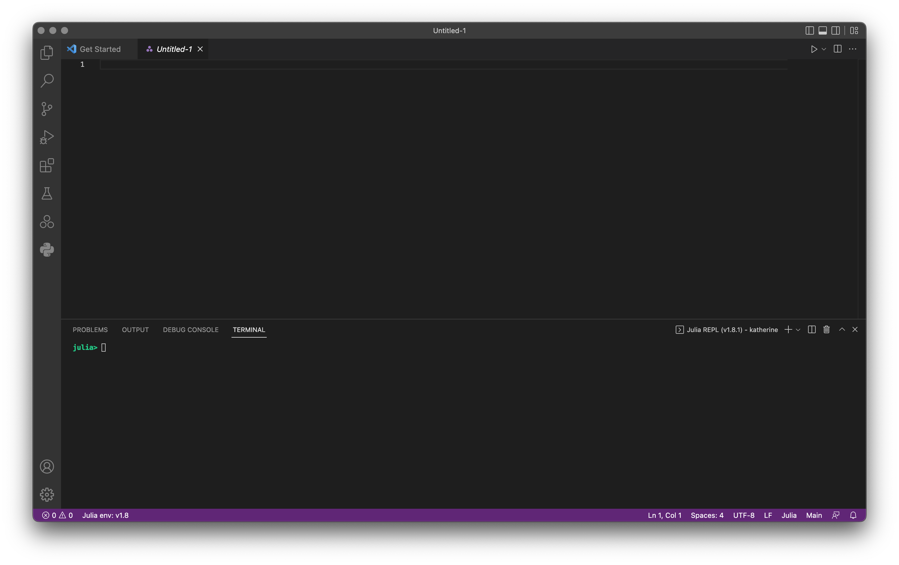

# Numerical methods in Julia tutorial

# Introduction

Welcome to JuliaTutorial.jl! The aim of this page is to get you quickly started with the Julia programming language.

I think Julia is perhaps the most productive gateway to the world of numerical methods for scientific computing, and I hope this can be a self-contained resource to get you started with Julia, its ecosystem, and exploring numerical methods.

!!! note "What is Julia and why should you learn it"

    Julia is a scientific programming language comparable to python, matlab, fortran, and R. It was originally created in 2012 by Jeff Bezanson, Stefan Karpinski, Viral Shah (and others) in the MIT Computational Science and Aritifical Intelligence Lab (CSAIL) as an open source project. 

    Since then, the language has amassed 8000 officially registered packages and become a dominant language for instruction and research in applied math departments at several top research universities, notably MIT and Stanford[]. The Julia community is still small compared to python, but in its niche of numerical computing, it is already very well established. 

    The primary purpose for creating Julia was solving the "two language problem". This is where a scientific programmer implementing complex algorithms in high-level/abstract languages (commonly python) must then convert or interface this code to a low-level/systems language (commonly C++/fortran) in order to get efficient performance. 

    Practically speaking, the two language problem means scientists must use C++/fortran (with all their many headaches) to get high performance software or else hope that someone else wrote something relevant in C++/fortran and made a convenient python interface for it such as numpy or scipy.

    Julia has arguably solved this problem through JIT (just-in-time) compilation along with host of other design decisions which enable a python-like syntax, but with the capability of C++/fortran speeds. This means we can make, for instance, a linear algebra package in pure Julia and have it run as fast (or sometimes faster[]) than C++/fortran ones such as openBLAS.

    This does come at the cost - mostly in added precompilation time when a function is first called. But I believe it is well worth it for most use cases in scientific computing. 

# Installation

Julia can be installed from its [official download page](https://julialang.org/downloads/).

It can also be installed via homebrew (on macs) by pasting the following command into a terminal. This command will install the current stable release (currently 1.8.1).

```
brew install --cask julia
```

Simply typing `julia` in a terminal to open a Julia REPL (read-evaluate-print-loop) session. You can use the REPL to evaluate simple Julia expression, manage Julia packages, run shell commands, and access documentation. Additionally, you can run a Julia file in you active directory by typing `julia my_julia_program.jl`. 

Let's open a julia REPL and type `print("hello world")`.
```
~ % julia
               _
   _       _ _(_)_     |  Documentation: https://docs.julialang.org
  (_)     | (_) (_)    |
   _ _   _| |_  __ _   |  Type "?" for help, "]?" for Pkg help.
  | | | | | | |/ _` |  |
  | | |_| | | | (_| |  |  Version 1.8.1 (2022-09-06)
 _/ |\__'_|_|_|\__'_|  |  Official https://julialang.org/ release
|__/                   |

julia> print("hello world")
hello world
```

The REPL is a great interface for using Julia quickly (to make a fast plot, overview your packages, or do a small calculation), but we will need a robust IDE (Integrated Development Environment) to write more complex code. There are many IDE's for various programming languages including Julia, but the easiest and most fully featured one for Julia is VS Code which we will install in the next section. 

!!! note "On Julia versions"

    Julia, like most actively used software, is under a constant state of development. This means you will find various older and newer versions of Julia out in the wild. These versions are distinguished by a version number, for example, 1.8.1 or 0.7.2. 
    
    This release scheme is very common in open source software (know as the [semantic versioning specification](https://semver.org)). The first number indicates a major release. For Julia this was the 1.0.0 release in 2018. 1.0.0 is considered a major milestone for open source development as it typically represents a commitment to major design decisions in the software and a certain amount of stability to what its interface looks like.

    The following two numbers are respectively a minor release and patch number. Minor releases are usually every 4-5 months. And patches are released as needed. You can read more about Julia's release process [here](https://julialang.org/blog/2019/08/release-process/#minor_releases).

    Typically, Julia code written for 1.0.0 will work if run by later versions of Julia (this is known as backwards compatability). However code written for a newer Julia version cannot be assumed to run on an earlier Julia version i.e. it is not forward compatible. This is usually because it incorporates language features which are not parseable by earlier Julia versions.

    Practically speaking, if you keep Julia updated to the current stable release, you won't run into version issues, but if you find yourself needing to use many different versions of Julia, for instance, if you want to test the latest releases or want to use a very old package, you can use the [juliaup](https://github.com/JuliaLang/juliaup) tool to conveniently manage many different Julia versions. 


# Using Julia in VS Code

VS Code can be installed from its [official download page](https://code.visualstudio.com/download).

It can also be installed via homebrew (on macs).

`brew install --cask visual-studio-code`

You can then open VS Code by typing `code` into a terminal. 

1. The Julia extension can be install by clicking the following extension button in the upper left of VS Code.


2. Search for "julia", and then click the blue install button. 
```@raw html
    
```
Next, let's make a .jl file to edit. Click new file.
```@raw html

```
And select `Julia File` to initialize a blank Julia file.
```@raw html

```
Finally, let's open up a REPL inside of VS Code (called the integrated terminal) using the default hotkey `ctrl + J + O`.

Congratulations! We are now set-up for working with Julia. 
```@raw html

```

!!! note "About VS Code"

    VS Code is designed to be a highly customizable, general purpose IDE which can work with just about any programming languages. It's most powerful features for Julia programming are:
    
    * An "extension marketplace" where you can install extensions to the IDE which give it support for various programming languages, color schemes and syntax highlighting, quality of life tools, and many others. 

    * Git integration which lets you quickly and seamlessly push commits to a remote git repository.
    
    * Remote development support which lets you develop and run code on other computers with nearly exactly the same workflow as your local machine. This is *very* convenient for working on cloud computing tools like AWS's EC2 as well as more traditional high performance computing infrastructure.

# Writing simple Julia programs

Type `1+1` into the editor window in VS Code and press `shift + enter` to execute the line your cursor is on (or execute multiple lines if you have them highlighted). By default, it will print an "inline result" next to the code as well as in the REPL session below your editor. 


This lends itself to an interactive workflow much like a jupyter notebook. This is the most basic workflow and suitable for writing scripts and exploring data, but if you are doing package development with unit tests and more complicated environments you will want to look at [Revise.jl](https://timholy.github.io/Revise.jl/stable/).

!!! note "Resources for learning Julia syntax"

    While this tutorial is meant to be a self-contained introduction to using the Julia language, I can't realistically guide you through all the in's and out's of its syntax. Here are a list of references in order of increasing time commitment which will be useful to you to pick up the syntax and bridge it with your existing knowledge of python. 

    1. [matlab-python-julia cheatsheet](https://cheatsheets.quantecon.org) - Quick way to see syntax differences between python and Julia for common operations
    2. [The Fast Track to Julia](https://juliadocs.github.io/Julia-Cheat-Sheet/) - Overview of the Julia language in one page
    3. [Official Julia languages documentation](https://docs.julialang.org/en/v1/) - Comprehensive overview of the entire language
    4. [Julia for Talented Amateurs](https://www.youtube.com/c/juliafortalentedamateurs/videos) - Extensive youtube channel with tutorials on most parts of the language, data analysis, GPU computing, etc. Also, many great memes. 


# The Julia package manager

Julia packages such as DifferentialEquations.jl or Plots.jl are collections of functions which can be imported to provide additional functionality to your Julia program. They are equivalent to libraries in other languages, for instance, python's numpy and Julia's LinearAlgebra.jl provide similar functionality. 

The Julia package manager, Pkg.jl, is itself a package, and it lets us import packages from various locations on the internet and manage them. It is essentially python's pyp and conda/venv all in one. 

We can access Pkg.jl in two ways. 

1. This is the less common way, but it can be accessed like any Julia package by typing `using Pkg` in either your editor window (with `shift+enter`) or the REPL. You can then import other packages (here Plots.jl) by typing `Pkg.add("Plots.jl")`. This will download Plots.jl from its official github repo to your `~/.julia/packages` folder and updates your project.toml file in `.julia/environments/1.8` which contains the default v1.8 environment. You can then access Plots.jl functions at any time by running `using Plots.jl` in Julia. 

2. The more common way is using the built in REPL interface. Type `]` into your REPL window. The `julia>` prompt will change into `(@v1.8) pkg>` indicating it now accepts Pkg.jl functions (use backspace to return to `julia>`). We can type `add Plots` to do the same thing we did above. In addition to `add` you can also `remove`/`rm` packages, list all your current packages with `status`/`st`, or run unit tests for the package `test Plots`.

!!! note "Accessing documentation and shell commands from the REPL"

    Pkg.jl is not the only tool with a nice REPL interface. We can access the documentation for a function or function call by typing `?` which will change `julia>` into a `help?>` prompt. Copy and paste code you want to know more about there to get its docstring, examples, and often a list of similar functions. Try pasting `print("help me!")` into it.

    Shell commands can also be called from the Julia REPL by typing `;` to get `shell>`. Typical shell commands like `ls` or `cd` work here exactly as they do in an external terminal.


# Plotting

Creating plots is perhaps the most fundamental thing you can do in scientific computing and it is also probably the quickest and most fun way to learn Julia.

To make a plot in Julia, run the following. 

```@example 1
using Plots
plot(sin)
```


We can also call `plot` on an array. 

```@example 1
plot([1,2,4,2,5])
```

Or put one plot on top of another by calling `plot!`. In Julia, it is convention to put a "!" after a function which modifies data. In this case, `plot!([1,2,4,2,5])` writes over our previous `plot(sin)`.

```@example 1
plot(sin)
plot!([1,2,4,2,5])
```


## Understanding the plot function call

Let's take a minute to unpack the function call `plot(sin)`. The function `plot` is explicitly exported from the "Plots.jl" package, so we do not need to write `Plots.plot` to specify it (though we would if we if we were working with several different plotting packages at once).

This function consists of many "sub-functions" known as "methods" which are specialized to different arguments for the function. When you call the function `plot(sin)`, Julia sees that you called `plot` on a single argument `sin` of type `Function` (functions are treated as just another data type in Julia such as Int64, FLoat64, etc). It can then use a method of `plot` which calls the function `sin` on a few values (here -5 to 5) which serve as the values on the x-axis. 

In contrast, `plot([1,2,4,2,5])` uses a slightly different method where it generates (x,y) coordinates based off of the index of the value in the array and the actual value of the array respectively.

 It is worth pointing out here that unlike python and many other programming languages, Julia has 1-based arrays meaning the first index is `1` not `0` which is why you see it plotted as 1 to 5 on the x-axis. 

!!! note "Multiple dispatch and polymorphism"

    Being able to infer what method to call based on the types of arguments is known as ["multiple  dispatch"](https://en.wikipedia.org/wiki/Multiple_dispatch) and it is the core design feature of the Julia language. It let's us have a ton of flexibility in a single function call such as `plot`. 

    The rough equivalent of multiple dispatch in other languages is function overloading (in C/C++) or objects in object oriented language (such as python and C++). The main purpose of multiple dispatch or object-oriented development is to create ["polymorphism"](https://en.wikipedia.org/wiki/Polymorphism_(computer_science)) in our program.

    Without using polymorphism we would be forced to write an ugly interface like `plot_array` and `plot_function` which would be extremely difficult for anyone to remember, and if we wanted to change anything about how we plot in general, we'd have to rewrite the code for every single one of such functions.

# Making animations with a few important language features

It is also possible to make simple animations in Plots.jl.

Let's make a sine wave which translates itself to the right. 

```@example 1
@gif for t in 0:0.5:6
    plot(x->sin(x-t))
end
```

There is a lot of syntax to unpack here, but I think it introduces a lot of important features of the Julia language.

    1. `@gif` is a "macro"
    2. `for t in 0:0.5:6...end` is a "for loop"
    3. `x->sin(x-t)` is an "anonymous function" or "lambda"

## Macros

Macros can be thought of as a generalization of the idea of a function.

A function takes arguments which are various data types for instance `sin` takes in types of `Number` such as `Int64`, `Float64`, etc and gives you a value you would associate with `sin` from its mathematical definition.

But instead of taking normal data types like `Int64`, *a macro takes a piece of Julia code as an argument*. This is an example of what is known as ["metaprogramming"](https://en.wikipedia.org/wiki/Metaprogramming#:~:text=Metaprogramming%20is%20a%20programming%20technique,even%20modify%20itself%20while%20running.) is a programming technique,even modify itself while running.). In this case, `@gif` uses our for loop with a `plot` call inside as a recipe to make an animation. 

You will likely rarely write these, but you will encounter and use them everywhere in the Julia ecosystem. 

The most useful macro in Base Julia is `@time` which will time the code after it. Just a function, you can read the documentation for a macro by using `?@time` in a REPL. 

```@example 1
@time sin(pi/2)
nothing # hide
```

!!! note "Benchmarking"

    Benchmarktools.jl has a more advanced version `@btime` which gives you more information than `@time`.

    ```julia
    julia> @btime sin(pi/2)
    1.167 ns (0 allocations: 0 bytes)
    ```

    BenchmarkTools.jl also allows you to profile code with `@benchmark`.  Here `@benchmark` runs code repeatedly and collects statistics on its performance. We can chain macros together, so lets add `@time` to check how long it to took get these statistics. 

    ```julia
    >julia @time @benchmark plot(sin)
    10.841423 seconds (247.36 M allocations: 5.504 GiB, 10.66% gc time, 0.31% compilation time)
    BenchmarkTools.Trial: 5812 samples with 1 evaluation.
    Range (min … max):  786.833 μs …   6.679 ms  ┊ GC (min … max): 0.00% … 80.84%
    Time  (median):     805.958 μs               ┊ GC (median):    0.00%
    Time  (mean ± σ):   858.419 μs ± 416.177 μs  ┊ GC (mean ± σ):  3.84% ±  6.87%

    ██▆▄▃▃▂▂▁▁ ▁▁                                                 ▁
    ██████████████▇▇▇▇▆▆▆▅▅▅▄▄▅▃▅▁▃▄▄▃▁▁▃▁▃▁▃▁▄▁▁▃▃▁▁▁▃▁▁▁▁▁▁▁▃▁▃ █
    787 μs        Histogram: log(frequency) by time        1.6 ms <

    Memory estimate: 497.41 KiB, allocs estimate: 21325.
    ```
## For loops

Most programming languages have constructions called "for loops" which allow execution of code repeatedly. 

In Julia the typical syntax is `for i in Iterators...end`. This is the fastest and most flexible way of making a for loop and is therefore the most commonly used for writing numerical methods.

`i` is the index variable and takes on the value of every element in "Iterator". Iterators are any data structure with many elements and an a ordering such as arrays, strings, and ranges. Here `1:5` is of type `Range`. We could also specify `1:2:5` to count by 2's or `range(0,2pi,length=5)` to go from 0 to 2pi in 5 steps.

    ```@example 1
    for i in 1:5
        print(i)
    end
    nothing # hide
    ```

!!! note "Other common patterns for making for loops"

    There are 3 other patterns for making for loops you will see in Julia (and other languages). These are typically used as a convenient syntax for applying some function element-wise to an array and returning the resulting array which is normally a little awkward to do with the usual for loop syntax. 

    (1) A "list comprehension". Very often we want to use a for loop to actually return an array for us rather than just loop through something. List comprehensions provide a nice syntax for this operation.

    ```julia
    julia> [sin(i) for i in 1:3]
    3-element Vector{Float64}:
    0.8414709848078965
    0.9092974268256817
    0.1411200080598672
    ```

    (2) "Vectorized functions" provide another fast syntax for applying a function to an iterator and returning an array. Simply put a `.` after the function to make it apply to every element in an array. 

    ```julia
        sin.(1:3)
    3-element Vector{Float64}:
    0.8414709848078965
    0.9092974268256817
    0.1411200080598672
    ```

    (3) The `map` function is yet another common way to apply a function to every element in an iterator.  

    ```julia
    julia> map(sin, 1:3)
    3-element Vector{Float64}:
    0.8414709848078965
    0.9092974268256817
    0.1411200080598672
    ```

## Anonymous functions

In many cases, we will want to define small functions that are essentially only used once in a program. Rather than clutter everything up with their definitions, we can use anonymous functions.

These are written like `x->sin(x)` or `(x,t)->sin(x-t)` for multiple arguments.  Compare with python `lambda x: sin(x).

By putting them in parentheses, we can call them like a normal function. 

```julia
julia> (x->sin(x))(pi/2) == sin(pi/2)
true
```
    
!!! note "Piping functions with |>"

    Anonymous functions are very useful if you have many functions you want to nest together. For instance, instead of writing something like:

    ```julia
    f(x,y) = plot(sin(cos(atan(y/x)+2)^2)
    ```
    or equivalently

    ```julia
    n = cos(atan(y/x)+2)^2
    b = sin(n)
    p = plot(b)
    ```

    We can get rid of a lot of parentheses by using a pipe operator `|>` which sends the output of the argument before it to the argument after it. This can often be much more readable. 

    ```julia
    f(x,y) = atan(y/x) |> _->cos(_+2)^2 |> sin |> plot
    ```


!!! note "The Julia plotting ecosystem"


# Making a linear solver with LU decomposition

Let's write our first numerical algorithm! There are many candidates for 


Anonymous functions in Julia use the folloing syntax `x->sin(x)`. Compare with python `lambda x: sin(x).


-Introduce this project
-Motivate the use of julia
    -speed
    -community
    -expressivness
-Ecosystem
    -DiffEq.jl
    -Plotting packages
-Resources
    -Cheatsheet for python
    -Julia for talented amateurs
-Getting started
    -Package manager
    -Installation
    -Main syntax
-Plotting
-LU system
-Homotopy continuation


